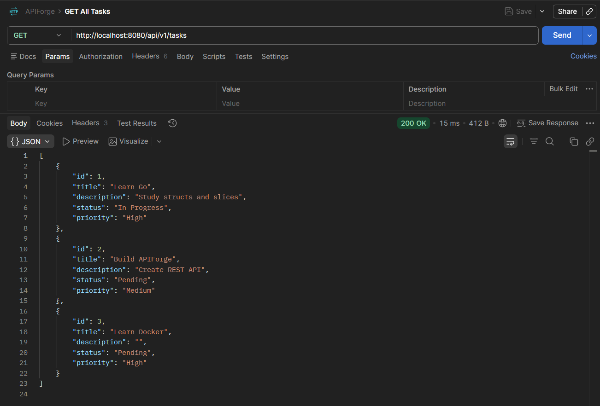
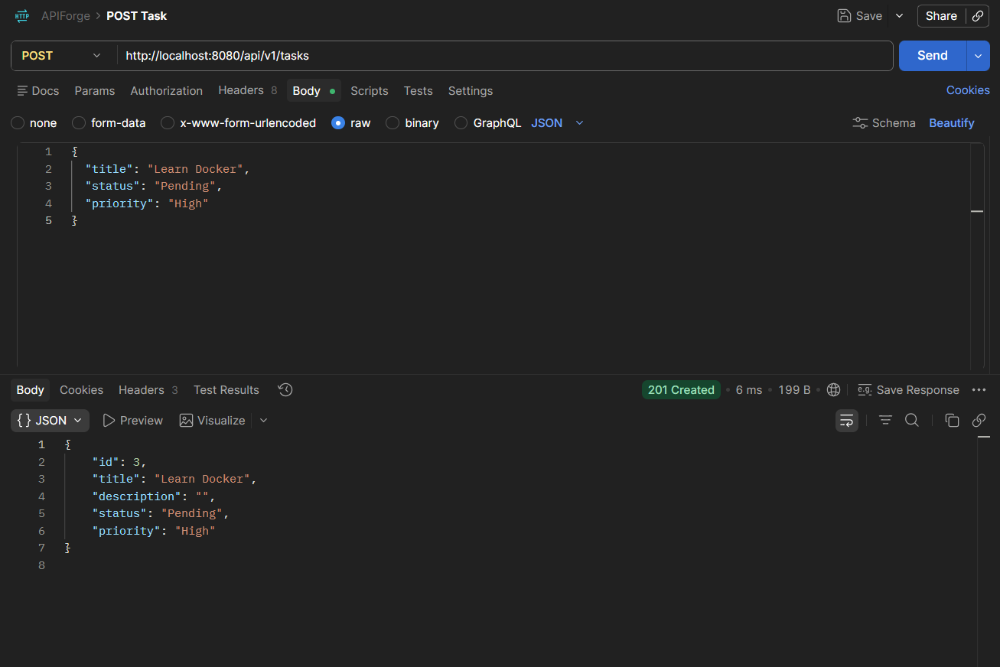
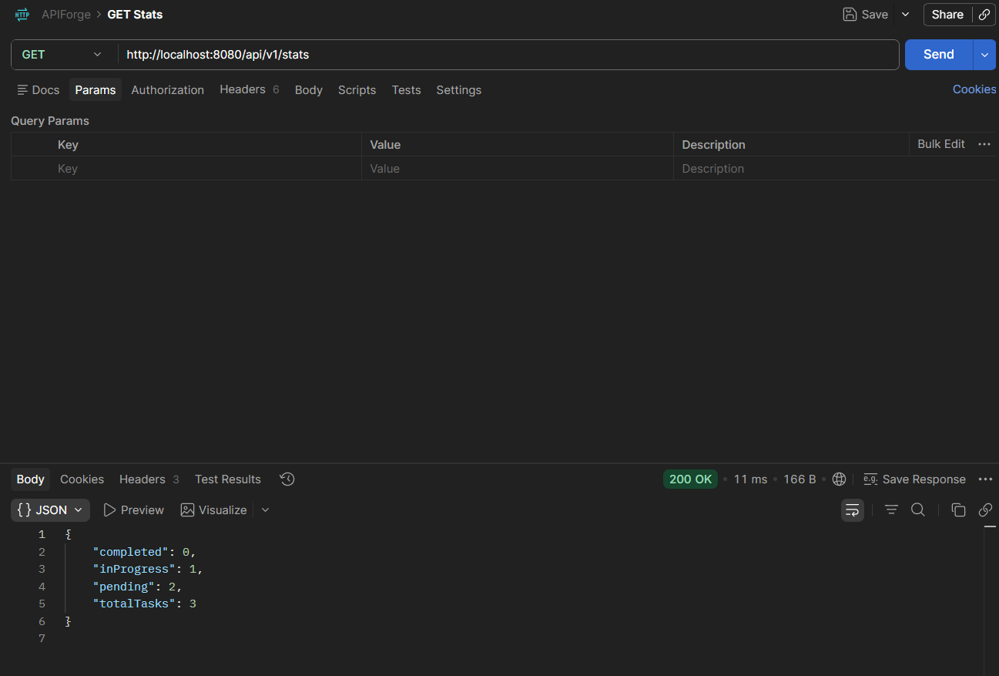
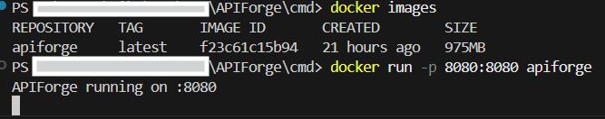

# 🚀 APIForge

APIForge is a Task Management REST API built with Go and Chi Router.

It provides CRUD operations, filtering, searching, sorting, validation, statistics, Docker support, and JSON persistence.

---

## ✨ Features

- Create Tasks
- View All Tasks
- Get Task By ID
- Update Tasks
- Delete Tasks
- Search Tasks
- Filter Tasks By Status
- Sort Tasks By Title
- Sort Tasks By Priority
- Input Validation
- Health Check Endpoint
- Statistics Endpoint
- Docker Support
- JSON File Persistence

---

## 🛠 Tech Stack

- Go
- Chi Router
- Docker
- Postman
- JSON Storage

---

## 📂 Project Structure

```txt
APIForge
│
├── cmd
│   └── main.go
│
├── internal
│   ├── handlers
│   ├── middleware
│   ├── models
│   ├── routes
│   ├── storage
│   └── utils
│
├── assets
│   ├── screenshots
│   └── postman
│
├── data
│   └── tasks.json
│
├── Dockerfile
├── go.mod
└── README.md
```

---

## 📡 API Endpoints

| Method | Endpoint | Description |
|----------|----------|----------|
| GET | / | API Information |
| GET | /api/v1/health | Health Check |
| GET | /api/v1/tasks | Get All Tasks |
| GET | /api/v1/tasks/{id} | Get Task By ID |
| POST | /api/v1/tasks | Create Task |
| PUT | /api/v1/tasks/{id} | Update Task |
| DELETE | /api/v1/tasks/{id} | Delete Task |
| GET | /api/v1/stats | Statistics |

---

## 🔍 Query Parameters

### Search

```http
GET /api/v1/tasks?search=go
```

### Filter

```http
GET /api/v1/tasks?status=Completed
```

### Sort

```http
GET /api/v1/tasks?sort=title
```

```http
GET /api/v1/tasks?sort=priority
```

---

## 📸 Screenshots

### Get Tasks



### Create Task



### Statistics



### Docker



---

## 🐳 Docker

Build:

```bash
docker build -t apiforge .
```

Run:

```bash
docker run -p 8080:8080 apiforge
```

---

## ▶️ Running Locally

```bash
go mod tidy
go run cmd/main.go
```

Server:

```txt
http://localhost:8080
```

---

## 📬 Postman Collection

Import:

```txt
assets/postman/APIForge.postman_collection.json
```

to test all endpoints quickly.

---

## 🔮 Future Improvements

- Database Integration (PostgreSQL)
- JWT Authentication
- Pagination Support

---

## 👨‍💻 Author

Built by Zeyad Badawy.
